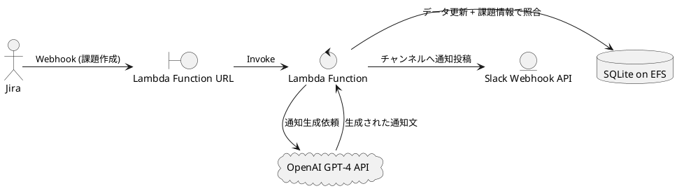

# SPEC-1-Jira-AI-Commenter

## Background

Jiraで課題が作成された際に、自動的にその内容に応じた通知を返すニーズがある。既存の業務DB（SQLite）との照合と、OpenAI APIによるLLMの活用によって、適切なフィードバックをSlackチャンネルに送信したい。

## Requirements

- **Must**: Jiraで課題が作成されたタイミングでWebhookを受け取る
- **Must**: SQLiteに格納された情報を照合し、通知内容を動的に生成する
- **Must**: OpenAI APIを利用して自然言語の通知を生成する
- **Must**: 通知は特定のSlackチャンネルに投稿される
- **Should**: セキュリティ対策としてWebhookのURLは非公開のランダムパス構造にする
- **Should**: SQLiteの内容はJira Webhook受信のたびに更新される構成とする
- **Could**: ログや処理状況をCloudWatch Logsで可視化

## Method

以下のアーキテクチャを採用する。

### AIエージェント的な処理方針

OpenAI APIは、Jiraから受け取った課題情報およびSQLiteスキーマ情報をプロンプトに含めることで、次のようなAIエージェント的な振る舞いを行います：

1. **Jira課題情報** を自然言語でプロンプトに含める
2. **SQLiteのスキーマ情報** をあらかじめ固定部分としてプロンプトに含める
3. LLMに **実行すべきSQLクエリの生成** を依頼（例：対応するFAQやテンプレ文の抽出）
4. 生成されたSQLクエリをLambdaで実行
5. 結果を元に、LLMに **最終的な通知文の生成** を依頼
6. 通知文をSlackへ送信



### 技術選定

| コンポーネント      | 技術                    | 備考                          |
| ------------ | --------------------- | --------------------------- |
| API Endpoint | Lambda Function URL   | Jira Webhookの受信エンドポイントとして利用 |
| 処理           | AWS Lambda (Python)   | 軽量な処理に適したサーバレス環境            |
| データベース       | SQLite3 on Amazon EFS | Lambdaからマウントして読み書き可能に利用     |
| AI連携         | OpenAI API (gpt-4)    | 通知文の生成処理                    |
| 通知送信         | Slack Webhook URL     | Slackチャンネルに投稿               |

### データ更新方法（Webhookトリガ）

- Lambdaの最初の処理で、直接EFS上のSQLiteファイルを更新（例：外部APIまたはDBから再構築）

### セキュリティ対応

- API GatewayのURLはランダムなパス構造（例：`/webhook/7e12af81b3`）で隠蔽
- 必要に応じてJira送信元のIPアドレス制限

---

## Implementation

### 1. インフラ構築

- Terraformで以下を定義・デプロイ：
  - Lambda Function（handler.py）
  - Lambda Function URL（Webhookエンドポイント）
  - EFS（SQLite DB格納）とマウントターゲット
  - Secrets Manager（Slack Webhook, OpenAIキー, Jira APIトークン）
  - IAM Role（LambdaがEFS・Secretsへアクセス可能）
- Terraform v1.5+ および AWS Provider ~>5.0 を想定
- Lambdaレイヤーに依存ライブラリをパッケージング
- ローカル検証環境として AWS SAM CLI または LocalStack を併用

### 2. Lambda処理フロー

1. Webhookリクエストを受信（Jira課題作成イベント）
2. Lambda内でSQLiteを更新（例：外部API/DBから取得して再構築）
3. 受け取った課題情報とDBスキーマを使って、OpenAIへSQL生成プロンプトを送信
4. SQLを実行し、得られたデータを再びOpenAIに渡し、Slack投稿用メッセージ生成
5. Slack Webhook URLへPOSTして通知

### 3. コード構成（例）

```
/lambda/
  ├── handler.py            # Lambdaメイン
  ├── sqlite_manager.py     # SQLite更新＆照会
  ├── prompt_builder.py     # プロンプト構築
  ├── openai_client.py      # OpenAI APIインターフェース
  └── slack_notifier.py     # Slack投稿処理
```

### 4. セキュリティ対応

- Jira送信元IPの制限（必要に応じて）
- Slack Webhook URLはSecrets Managerで管理
- Webhook URLは非公開でランダム化

---

## Milestones

| フェーズ   | 内容                                            | 担当              | 目安期間 |
| ------ | --------------------------------------------- | --------------- | ---- |
| **M1** | Jira Webhookの構成と受信検証（API Gateway + Lambda連携）  | Backend         | 1日   |
| **M2** | EFS構築とLambdaマウント、SQLite読み書き確認                 | Infra / Backend | 1日   |
| **M3** | SQLite更新処理の実装（外部データからの再構築含む）                  | Backend         | 1日   |
| **M4** | OpenAI API連携とプロンプト構築・応答処理の実装                  | AI / Backend    | 1〜2日 |
| **M5** | Slack通知処理の実装とWebhook連携テスト                     | Backend         | 0.5日 |
| **M6** | セキュリティ設定（Secrets Manager, Webhook非公開URL）      | Infra           | 0.5日 |
| **M7** | 統合テスト（エンドツーエンド）とCloudWatch Logs確認             | QA              | 1日   |
| **M8** | Terraformによるインフラコード化とCI/CD導入（GitHub Actions等） | DevOps          | 1〜2日 |
| **M9** | 開発体験整備（LocalStack, LLMサンドボックス, テスト実装）         | 全体              | 1日   |

---

## Optional Features

### ⏰ 期限超過チケットの定期通知機能（後追い予定）

Jira APIを使って、期限日を過ぎた未完了の課題を毎日Slack通知する機能。 LLMを使わず、テンプレートベースでの通知を基本とする。

#### 特徴

- 定時実行：Amazon EventBridge + Lambda（例：毎朝9:00）
- Jira JQL：`duedate < now() AND statusCategory != Done`
- Slack通知形式：
  ```
  [Jira期限切れチケット通知]
  - PROJ-123: レビューが未完了です（期限: 2025-07-31）
  - PROJ-124: テスト未実施（期限: 2025-07-30）
  ```
- OpenAI使用は任意、通知文章の自然化や分類をしたい場合のみ使用

#### 想定コード構成追加

```
/lambda/
  └── cron_notifier.py  # Jira → Slack の定期通知処理
```

#### 今後の設計タスク

- TerraformにスケジュールLambda用リソース追加
- Jira認証トークンの管理（Secrets Manager）
- 通知形式のカスタマイズ有無確認

---

## Gathering Results

このシステムが成功したかどうかを以下の観点で評価します：

### 🎯 機能要件達成度

- Jira課題作成イベントがLambdaを確実にトリガーしている
- SQLiteファイルが正しく毎回更新され、最新状態で照合されている
- OpenAIが適切なSQL文を生成し、実行結果が正しい
- Slackへの投稿が意図したチャンネル・フォーマットで送られている

### 📈 運用・品質指標

| 指標項目                         | 評価基準                     | 備考                         |
|----------------------------------|------------------------------|------------------------------|
| Lambda実行時間                  | < 5秒（P95）                 | 長い処理はリトライ発生要因に |
| Slack通知までの遅延             | < 10秒                       | ユーザ通知の鮮度確保         |
| Lambdaの失敗率                  | < 1%                         | エラー原因はCloudWatchで確認 |
| EFS読み書き整合性               | 書き込み後即読出し可能な状態 | 破損・競合がないこと         |
| CloudWatch Logsでの監視        | エラー発生時に通知 or 可視化 | 例：Error, Exception         |

### 🔧 外部サービス準備手順

#### Slack 側

- Slackアプリを作成し、Webhook URLを発行（チャンネルへの送信権限を付与）
- Webhook URLをSecrets Managerに保存

#### Jira 側

- Jira CloudでWebhook設定を追加
  - トリガー：Issue Created
  - 送信先：Lambda Function URL（ランダムパス）
- Webhookの送信元IPがあれば記録・IP制限（必要に応じて）

#### OpenAI 側

- OpenAI APIキーを取得
- モデル（gpt-4）とトークン制限を確認
- Secrets Managerに保存

---

## Need Professional Help in Developing Your Architecture?

Please contact me at [sammuti.com](https://sammuti.com) :)

